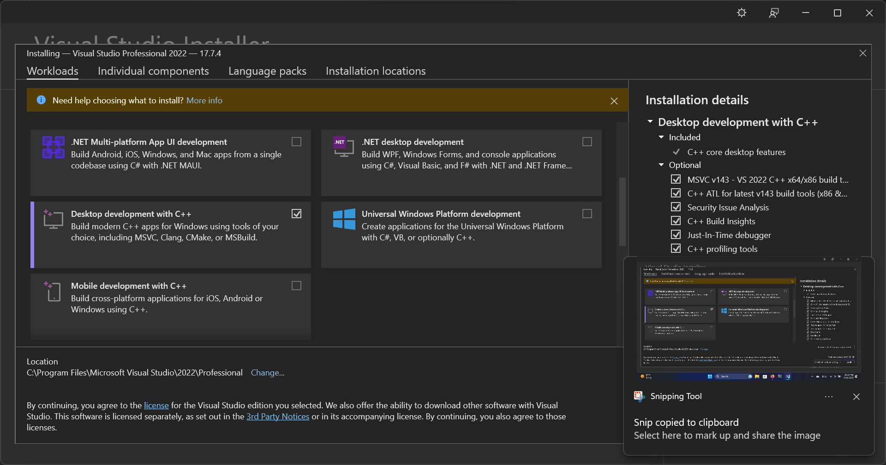
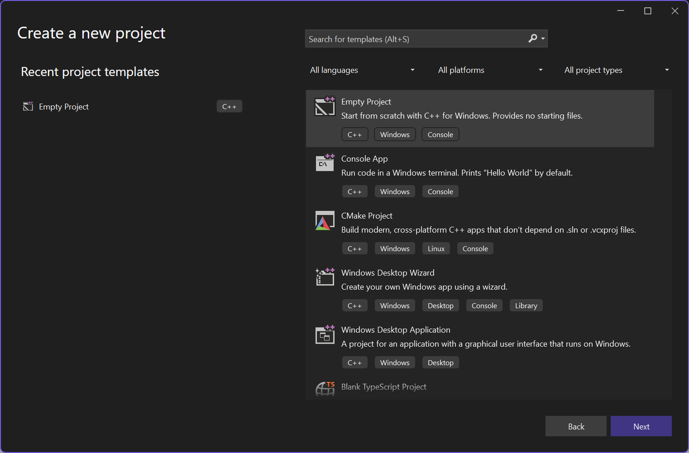
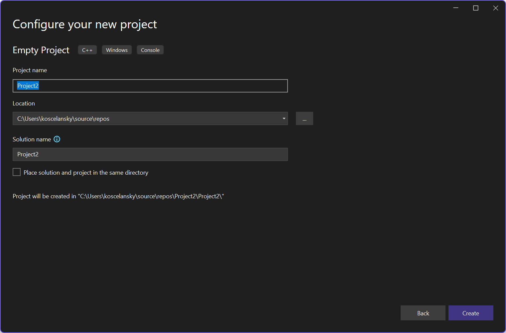
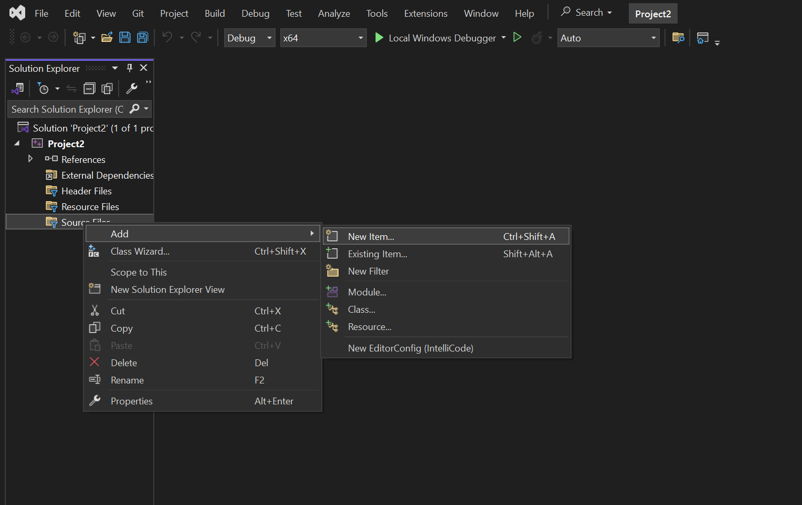
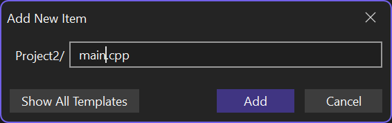

# Prostredie

Budeme kompilovať naše projekty ako najštandardnejšie C++ zo štandardných C++. Takže musíme povypínať rôzne rozšírenia kompilátorov, neštandartné konštrukcie a čisto C konštrukcie.

Samozrejme môžete použiť kompilátor aký chcete, ale oficiálne je podporované Visual Studio 2022 a GCC 13+.

## Inštalácia VS 2022

Pri inštalácií nezabudnite zakliknúť, že chcete aj C++ vývojové nástroje.



## Nastavenie VS 2022

Po spustení Visual Studia zvoľte **Create new project**. Pri vytváraní projektu vyberte *Empty project*. Môžete aj *Console application*, ale pre naše potreby je lepší prázdny projekt.



Vyberte si meno projektu a prípadne aj umiestnenie a potvrďte kliknutím na *Create*.



Teraz musíme pridať do projektu súbor, v ktorom budeme vytvárať náš program.



Pridáme nový .cpp súbor (môžeme ho nazvať napríklad main.cpp keďže bude obsahovať našu funkciu main, teda náš vstup do programu).



Do súboru napíšeme náš program. Napríklad

```cpp
#include <iostream>

int main() {
    std::cout << "Hello world!\n";
}
```

Po stlačený *F5*, alebo kliknutí na *Local Windows Debugger* by sa mal náš program skompilovať a spustiť. Teraz v nastaveniach projektu pomeníme nasledujúce možnosti.


C/C++ → Language → Disable Language Extensions na Yes (/Za)
C/C++ → Language → Conformance Mode uistíme sa, že je Yes (/permissive-)
C/C++ → Language → C++ Language Standard na ISO C++ Standard (/std:c++20)
C/C++ → Language → Treat Warnings As Errors (Yes (/WX))
C/C++ → Preprocessor → Use Standard Conforming Preprocessor (Yes (/Zc:preprocessor))
C/C++ → General → Warning Level uistíme sa, že je na Level4 (/W4)
C/C++ → All Options → Additional Options nastavíme na /w44388 %(AdditionalOptions)

## Nastavenie GCC

Naše testy používajú GCC 13.2. Nemal by byť problém ani so staršími verziami, pokiaľ majú viacmenej úplnu podporu pre C++17 a aspoň čiastočnú pre C++20. 

Minimálne by ste mali používať tieto parametre -pedantic-errors --std=c++20 -pthread -Wall, ideálne si pridať (my ich budeme používať všetky) aj -Wextra -Wformat=2 -Wlogical-op -Wmissing-include-dirs -Wredundant-decls -Wstrict-overflow -Wundef -Wnull-dereference -Walloca -Wcast-qual -Werror=vla. Možno aj ďalšie, to si už nastavte podľa chuti 😃 .

## Visual Studio Code

Do populárneho editoru VS Code máme template pre MSVC aj pre GCC, tieto sú ale bez záruky, keďže sme ešte nemali dosť času ich otestovať. Na 95% sú ale dobre.

[VS Code MSVC Project](/_files/APC-project-MSVC.zip) (Na správne fungovanie je potrebné aj rozšírenie C/C++)

[VS Code GCC Project](/_files/APC-project-GCC.zip) (Musíte mať C/C++ rozšírenie, zároveň nainstalovaný gdb a gcc aspoň verzie 11, testované na Ubuntu 22.04 a 22.04)

Alebo môžete použit devcontainer na programovanie C++. Prípadne použiť vyrobený [devcontainer](/_files/APC-project-devcontainer.zip). 